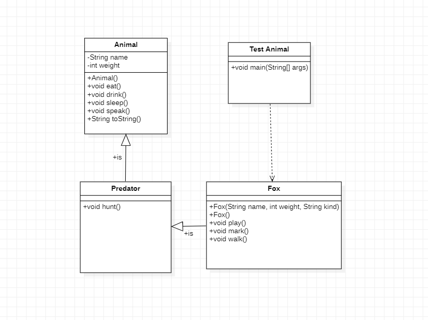
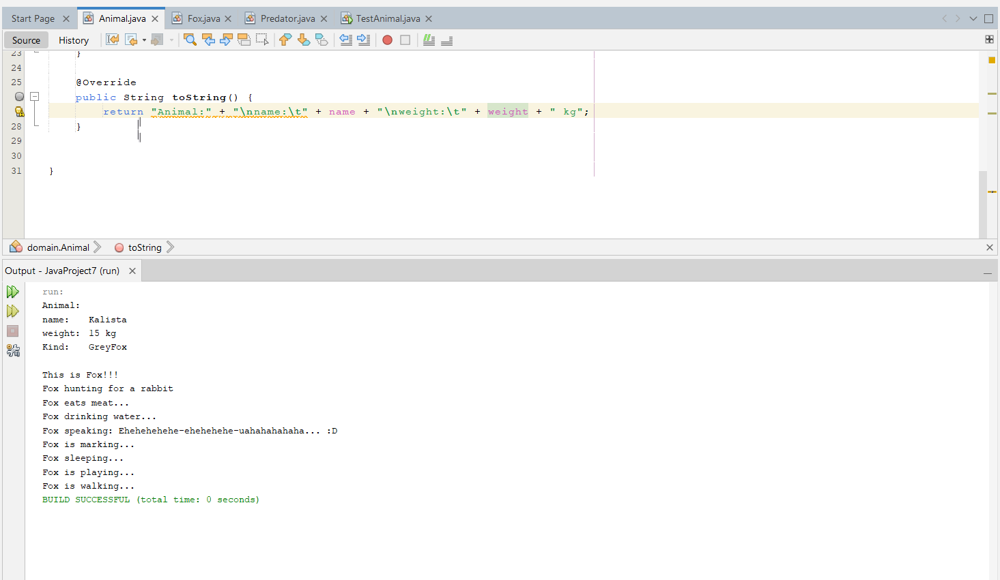

[](https://classroom.github.com/open-in-codespaces?assignment_repo_id=10176987)
# Практична робота "Реалізація успадкування"
## Обрав лисицю для цієї практичної, (Спочатку робив модоїда, потім зрозумів що він черезчур багато що може витворяти, тому взяв попроще)
**Діаграма** **UML:**

**Код** **Animal:**
```
package domain;
public class Animal {
    
    protected String name;

    protected int weight;

    public Animal() {
        name="Generic animal";
        weight=16;
    }
    public void eat() {
        System.out.println("Animal eating...");
    }
    public void drink() {
        System.out.println("Animal drinking...");
    }
    public void sleep() {
     System.out.println("Animal sleeping...");   
    }
    public void speak() {
        System.out.println("Animal speaking...");
    }

    @Override
    public String toString() {
        return "Animal:" + "\nname:\t" + name + "\nweight:\t" + weight + " kg";
    }
}
```
**Код** **Fox:**
```
package domain;
public class Fox extends Predator {

    private String kind;
    
    public Fox(String name,int weight,String kind) {
        this.name=name;
        this.weight=weight;
        this.kind=kind;
    }

    public Fox() {
        this("Jeki",15,"GreyFox");
    }

    public Fox(String name) {
        this(name,15,"GreyFox");
    }
    
    public void play() {
        System.out.println("Fox is playing...");
    }
    public void mark() {
        System.out.println("Fox is marking...");
      
    }
    
    public void walk() {
        System.out.println("Fox is walking...");
    }

    @Override
    public void hunt() {
        System.out.println("Fox hunting for a rabbit"); 
    }

    @Override
    public String toString() {
        return super.toString()+"\nKind:\t"+this.kind+"\n\nThis is Fox!!!"; 
    }

    @Override
    public void speak() {
        System.out.println("Fox speaking: Ehehehehehe-ehehehehe-uahahahahaha... :D"); 
    }

    @Override
    public void sleep() {
        System.out.println("Fox sleeping...");
    }

    @Override
    public void drink() {
        System.out.println("Fox drinking water...");
    }

    @Override
    public void eat() {
       System.out.println("Fox eats meat...");
    }
}
```
**Код** **Predator:**
```
package domain;

public class Predator extends Animal {

    public void hunt() {
        System.out.println("Predator is huntring...");
    }
}
```

**Код** **TestAnimal:**
```
package test;

import domain.Fox;

public class TestAnimal {
    
    public static void main(String[] args) {
        Fox fox= new Fox("Kalista");
        System.out.println(fox);
        fox.hunt();
        fox.eat();
        fox.drink();
        fox.speak();
        fox.mark();
        fox.sleep();
        fox.play();
        fox.walk();
    }
}
```
# Результат роботи:
